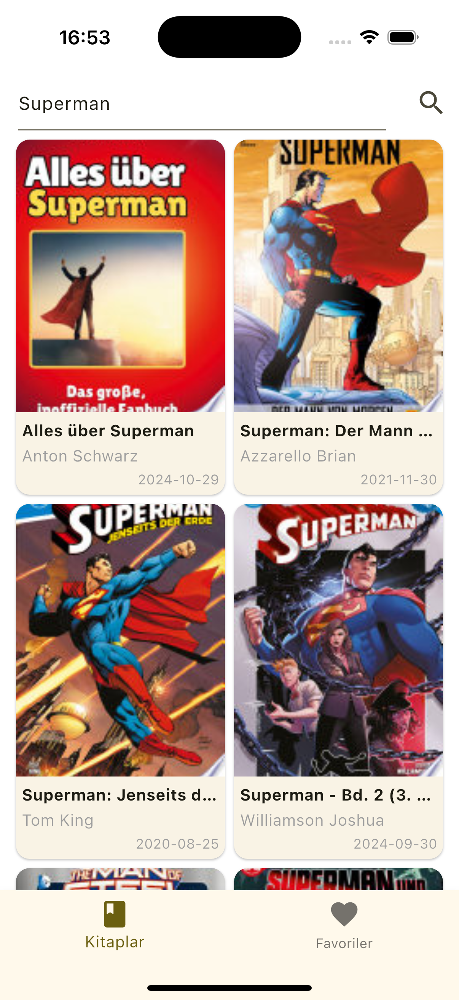

# Google Books Client 📚

This project is a simple book search application developed using Flutter.
You can search for books via the Google Books API, view details, and add them to your favorites.

## 🚀 Installation and Running

Follow the steps below to run the project:

```bash
git clone https://github.com/cetfu/GoogleBooksClient.git
cd GoogleBooksClient
flutter pub get
flutter run android     # For Android devices/emulators
flutter run ios         # For iOS devices/simulators (on macOS)
```

## ✨ Features

* Book search via Google Books API
* Viewing book details
* Adding books to favorites

## 🧪 Technologies and Packages Used

* Flutter 3.29.3
* MVVM architecture
* [http](https://pub.dev/packages/http) – For API calls
* [Provider](https://pub.dev/packages/provider) – For state management
* [flutter\_html](https://pub.dev/packages/flutter_html) – To render HTML content
* [shared\_preferences](https://pub.dev/packages/shared_preferences) – To store favorites

## 🌐 API

This app uses the [Google Books API](https://developers.google.com/books).
It supports operations such as book searching and retrieving book details.

## 📦 Release

You can access the release build for Android from the [Actions](https://github.com/cetfu/GoogleBooksClient/actions) tab.
It is uploaded as a Workflow Artifact.

## 🖼️ Screenshots

| Book List                                       | Book Details                                     |
|-------------------------------------------------|--------------------------------------------------|
|           |    |
| Book Search                                     | Book Details                                     |
|  |  |
| Favourites                                      |                                                  |
|         |                                                  |